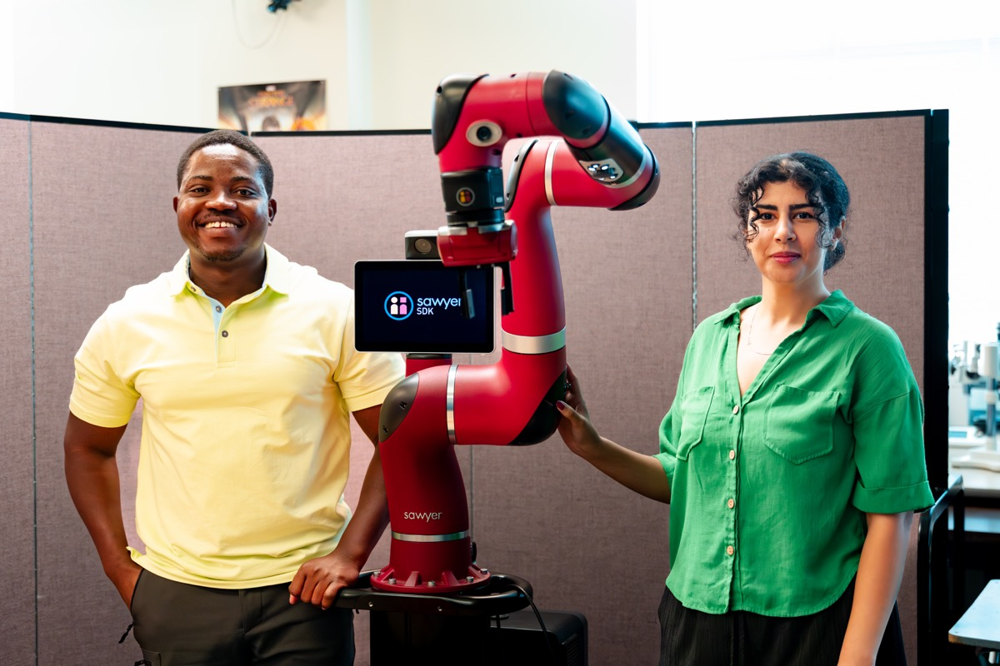

---
metadata-files:
  - ../_assets/revealjs-defaults.yml
title: "Beyond the Survey Real-Time [Physiological Sensing]{.accent} for Human-Machine Teaming"
subtitle: "Part 1 — Foundations of Human-Machine Interaction"
author:
  - "Elahe Oveisi"
  - "Dr. Hemanth Manjunatha"
institute: "Oklahoma State University"
date: "2026-07-13"
format: revealjs
title-slide-attributes:
  data-background-image: ../../images/campus/campus.jpg
  data-background-opacity: "0.3"
  data-background-color: "#252525"
---

## About Me {background-color="#252525"}

::: {.columns}
::: {.column width="60%"}

**Elahe Oveisi**
PhD Student, Aerospace and Mechanical Engineering
Oklahoma State University

- Background in human factors and ergonomics
- Research focus: human–AI interaction, aviation safety, and safety-critical decision support
- Current work examines how AI can support, but not replace, human judgment in complex systems

:::
::: {.column width="40%"}

:::
:::

---

## Agenda {background-color="#252525"}

<strong>Foundation of Human-Machine Interaction</strong>

<strong>Discussion</strong>

<strong>Case Study</strong>

<strong>Discussion</strong>

---

## [Human-Machine]{.accent} Teaming {background-color="#252525"}

::: {.hook}
Not every machine collaborator is an AI — and not every AI is a teammate.
:::

- **Human–machine teaming** is a broad term: teamwork between humans and any type of machine, including mechanical systems, automated systems, or intelligent systems
- **Human–AI teaming** is a more specific form of human–machine teaming: it focuses on collaboration with AI systems that can perceive information, reason, adapt, and communicate

---

## What is [Human–AI]{.accent} Teaming? {background-color="#252525"}

One or more humans and one or more AI agents working toward a shared goal, each with their own roles, coordinating like teammates.

AI as a Teammate

Acts with initiative; shares the thinking. Communicates, explains, adapts to context. Coordinates with humans toward a shared goal.

AI as a Tool

Fixed function (calculator, autopilot mode). Human monitors and supervises it.

---

## Why [Human-AI Teaming]{.accent} is Important? {background-color="#252525"}

Aviation

Monitor flight systems + AI decision aids

Healthcare

Diagnostic AI; alarm management

Driving

Automated driving

Search &amp; Rescue

Operators + autonomous drones and robots

::: {.punchline}
Defense — AI quickly checks sensor data and highlights problems.
:::

---

## Efficient [Human-AI]{.accent} Teaming {background-color="#252525"}

Situational Awareness

Does the human still understand what is happening, and what happens next?

Mental Workload

Is the human's cognitive demand in the productive zone — not overloaded, not disengaged?

::: {.punchline}
Trust — does the human rely on the AI the right amount? No blind faith, no needless rejection.
:::

---

## [Situational]{.accent} Awareness {background-color="#252525"}

<strong>Perceive</strong> Notice the relevant elements: where are the drones?

&#9660;

<strong>Comprehend</strong> Understand what those elements mean for the mission right now

&#9660;

<strong>Project</strong> Anticipate what happens next: where will the target be in two minutes?

::: {.punchline}
When AI performs more of the work, humans can become "out of the loop" — reducing situational awareness and making it harder to detect errors or take over when needed.
:::

---

## [Trust]{.accent} {background-color="#252525"}

Under Trust

Ignoring good recommendations — rejecting accurate advice, doing everything manually

Over Trust

Blind reliance on AI — accepting AI output without checking

::: {.punchline}
Optimized trust matches the AI's true reliability — rely on it where it's strong, verify where it is weak.
:::

---

## Mental [Workload]{.accent} {background-color="#252525"}

::: {.columns}
::: {.column width="50%"}

**Demand vs. capacity**

- Too high &rarr; errors, tunnel vision, missed alarms
- Too low &rarr; boredom, disengagement
- AI teammates should keep humans in the **productive middle**, reducing the work without pushing them out of the loop

:::
::: {.column width="50%"}

**NASA-TLX: the classic measure**

- Mental demand
- Physical demand
- Temporal demand
- Performance
- Effort
- Frustration

:::
:::

---

## Measuring [Human-AI]{.accent} Teaming Components {background-color="#252525"}

| Scale | Measures | Description |
|---|---|---|
| NASA-TLX | Workload | Six-dimension rating after the task (mental, physical, temporal demand; performance, effort, frustration) |
| SART / SAGAT | Situational Awareness | SART: self-rated awareness. SAGAT: freeze the simulation and quiz the operator |
| Trust in Automation Scale | Trust | 12-item Trust in Automation Scale (TIAS) |
| Performance | Behavior | Mission success, errors, response time; acceptance of AI suggestions, verification rate |

---

## Physiological [Measurements]{.accent} {background-color="#252525"}

::: {.columns}
::: {.column width="50%"}

**Eye Tracking**

- Fixations & dwell time: what is being attended, for how long
- Scan patterns: is monitoring systematic or chaotic?
- Pupil size also tracks cognitive load

:::
::: {.column width="50%"}

**EEG**

- Electrodes on the scalp record electrical brain activity in real time
- Mental workload and engagement
- Millisecond resolution, but noisy; needs careful cleaning

:::
:::

---

## [Questions]{.accent} {background-color="#252525"}

Current Challenges

Biggest challenges in human–AI teaming? Which are overlooked? Which is hardest to solve? Which should researchers study first?

AI Design

What makes AI a good teammate? What capabilities are missing? How should AI communicate? How much autonomy should AI have?

Future Research

Biggest research gaps? Most promising technologies? What studies are still needed? What should researchers focus on next?

Evaluation

How should human–AI teaming be evaluated? Objective vs. subjective measures? What outcomes are often missed?

::: {.punchline}
Human Factors — which of workload, trust, and situational awareness matter most, are hardest to measure, or are most often ignored?
:::

---

## Human-AI [Case Study]{.accent} {background-color="#252525"}

::: {style="display:flex; flex-direction:column; align-items:center; justify-content:center; height:70vh; text-align:center;"}

::: {style="font-family:'Rubik',sans-serif; font-size:2.4rem; font-weight:900; color:#ffffff;"}
Rescue-Grid: An Open Platform for [Human-Machine Teaming]{.accent}
:::

:::

---

## [Questions]{.accent} (Second Round) {background-color="#252525"}

Future AI Teammates

What should future AI teammates do? What tasks are best for AI vs. humans? What makes an ideal human–AI team?

Adaptive AI

What should AI adapt to? When should it provide more or less help? Should AI adapt differently for different users?

Trust

Which factors influence trust the most? How is appropriate trust developed, maintained, and measured?

Evaluation

How do we know AI improves teamwork? Are current evaluation methods enough? What is missing from today's studies?

::: {.punchline}
Future Research — what questions still need answers, and what challenges must be overcome before AI teammates can be widely used?
:::

---

## {background-image="../../images/campus/campus_2.jpg" background-opacity="0.25" background-color="#252525"}

::: {style="display:flex; flex-direction:column; align-items:center; justify-content:center; height:80vh; text-align:center;"}

{style="max-height:110px; border-radius:0 !important; box-shadow:none !important;"}

::: {style="font-family:'Rubik',sans-serif; font-size:2.8rem; font-weight:900; color:#ffffff; margin-top:0.8rem;"}
Thanks!
:::

::: {style="font-size:1.5rem; color:#EC672C; margin-top:1.2rem; font-weight:700;"}
Questions?
:::

::: {style="font-size:1.5rem; color:rgba(255,255,255,0.35); margin-top:1rem; letter-spacing:2px;"}
hemanth.manjunatha@okstate.edu
:::

:::
